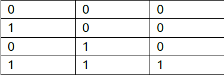
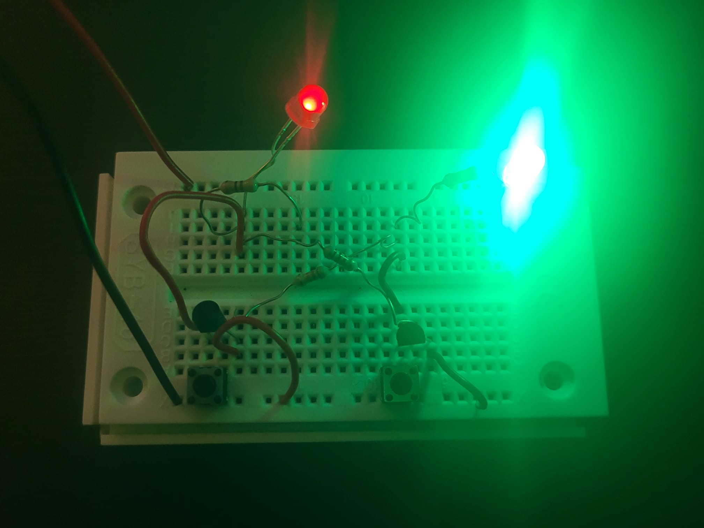

# Transistor Vertiefung

Verfasser: **Maksymilian Saferyjski 2CHIT**

Datum: **20.01.2025**

## 1.  Einführung

Transistoren sind einer der wichtigsten elektronischen Bauteile der Welt. 
Es gibt Milliarden Transistoren in unseren Geräten, ohne Transistoren gäbe es keine Computer. 
Ein Transistor dient als Schalter, kann aber auch als Verstärker genutzt werden. Transistoren können genutzt werden, um logische Operationen wie z.B. UND, ODER, NOT zu realisieren.  

## 2.  Projektbeschreibung

Es wurde eine NOT, UND, ODER und eine Transistor Verstärkerschaltung simuliert, realisiert und durchgemessen.

## 3.  Theorie

Wie werden Transistoren eingesetzt um logische Funktionen (Und, Oder, Nicht) zu realisieren?

Die Transistoren werden als Schalter benutzt, um logische 1er und 0er zu simulieren, zudem können Transistoren als Verstärker benutzt werden.
Sie werden dann mit Dioden und Widerständen kombiniert, um logische Berechnungen durchzuführen. 

**UND (AND)**

Bei einer UND-Schaltung werden die Transistoren seriell geschaltet.

Der Ausgang ist HIGH (1), wenn beide Eingänge HIGH (1) sind.

**ODER (OR)**

Bei einer OR-Schaltung werden die Transistoren parallel geschaltet.

Der Ausgang ist HIGH (1), wenn einer oder beide Eingänge HIGH (1) sind.

**NICHT (NOT)**

Bei einer NOT-Schaltung wird ein Transistor als Inverter verwendet.

Der Ausgang ist HIGH (1), wenn der Eingang LOW (0) ist.

Der Ausgang ist LOW (0), wenn der Eingang HIGH (1) ist.

Welche Einschränkungen sind dabei zu beachten?

**Spannung**

Transistoren haben eine maximale Eingangsspannung, die nicht übertreten werden darf.

**Strom**

Transistoren haben einen maximalen Eingangsstrom, der ebenfalls nicht übertreten werden darf, sonst besteht der Fall, dass der Transistor beschädigt wird.

Wie funktioniert die Verstärkung von Signalen mittels Transistor?

Transistoren können als Verstärker eingesetzt werden, um schwache elektrische Signale zu verstärken. 

Dies geschieht durch die Steuerung eines großen Ausgangsstroms mit einem kleinen Eingangsstrom an der Basis des Transistors.
Ein kleiner Strom an der Basis eines Transistors beeinflusst den größeren Kollektorstrom.

Das schwache Eingangssignal wird an die Basis des Transistors angelegt.

Der Transistor verstärkt das Signal, indem er den Kollektorstrom in Abhängigkeit vom Basisstrom steuert.

Das resultierende Ausgangssignal ist ein verstärktes Signal im Vergleich zum Eingang.

Wie hoch ist der Verstärkungsfaktor eines Transistors, und wie berechnet sich dieser?

Je nach Bauart 100 bis 1000. 

Dieser Faktor kann durch die Formel: B = Ic/Ib berechnet werden.

Erkläre deine aufgebaute Schaltung.

Wie man am Schaltplan erkennen kann, besteht diese Schaltung aus einer in Sperrrichtung gerichteten, roten LED, einer grünen LED und einer Darlington-Schaltung. Die rote LED fungiert als eine Art Fotodiode, weil sie einen kleinen Fotostrom auslässt, der durch die Darlington-Schaltung verstärkt wird. Somit wird ein Strom stark genug erzeugt, dass die rote LED anfängt zu leuchten. Jedoch ist der Fotostrom von der Belichtung abhängig, je dunkler es ist, desto schwächer leuchtet die LED, desto heller, desto stärker leuchtet die LED.
Die Verstärkung kann man mit dem Voltmeter nachvollziehen. Die Basisspannung des ersten Transistors beträgt, 2 mV, beim zweiten 119,3 mV. Somit wird die Kollektorspannung von 5,75 V auf 6,47 erhöht.

## 4.  Arbeitsschritte

AND-Schaltung simulieren und aufbauen

Messschaltung

AND-Schaltung messen 

**Ergebnisse**

* 1,18 mA Eingang HIGH
* 1,18 mA Eingang HIGH

* 0,85 mA Eingang HIGH
* 0 mA Eingang LOW

* 0 mA EINGANG LOW
* 1,20 mA EINGANG HIGH

OR-Schaltung simulieren und aufbauen

Messschaltung

OR-Schaltung messen

**Ergebisse**

* 0,35 mA Eingang HIGH
* 0,35 mA Eingang HIGH

* 0,35 mA Eingang HIGH
* 0 mA Eingang LOW

* 0 mA Eingang LOW
* 0,35 mA Eingang HIGH

NICHT-Schaltung simulieren und aufbauen

Messschaltung

NICHT-Schaltung messen

**Ergebnisse**

* 0,33 mA Eingang HIGH
* 0 mA Eingang LOW

Verstärkerschaltung simulieren und aufbauen

Verstärkung messen

Kollektorspannung 1, 2 Transistor: 7,85 V

Basisspannung 1. Transistor: 2 mV

Basisspannung 2. Transistor: 0,47 V

Ib = 18 nA

Ic = 9,34 mA

B = 18/9,34 = 518.890

Kippschaltung aufbauen

## 5.  Zusammenfassung

In der Arbeit wurden Transistoren in verschiedenen Schaltungen verwendet, um ihre Funktion als logische Bauteile und Verstärker zu demonstrieren. 

Es wurden UND-, ODER- und NICHT-Schaltungen simuliert, aufgebaut und gemessen, wobei die Transistoren in unterschiedlichen Konfigurationen als Schalter für logische Operationen agierten. 

Zudem wurde eine Verstärkerschaltung mit einer Darlington-Konfiguration realisiert, die eine starke Signalverstärkung ermöglichte.

## 6.  Quellen

[1] Systemtechnik Theorie Unterlagen, elearning. [online] Available at: https://elearning.tgm.ac.at/mod/assign/view.php?id=113986 [Accessed 22 January 2025].

[2] Franzis Handbuch - Elektronik, [online] Available at: https://elearning.tgm.ac.at/mod/assign/view.php?id=113986 [Accessed 22 January 2025].

[3] Elektronik-Fibel, [online] Available at: https://elearning.tgm.ac.at/mod/assign/view.php?id=113986 [Accessed 22 January 2025].

[4] Operationsverstärker, studify. [online] Available at: https://elearning.tgm.ac.at/mod/assign/view.php?id=113986 [Accessed 22 January 2025].

